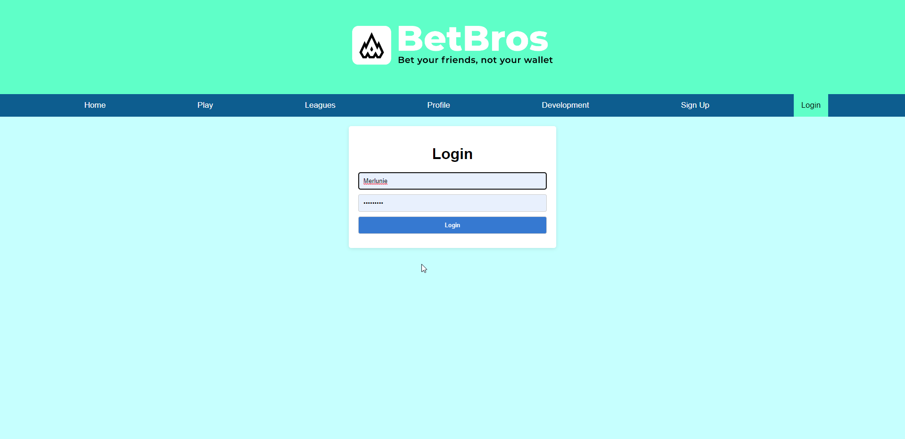
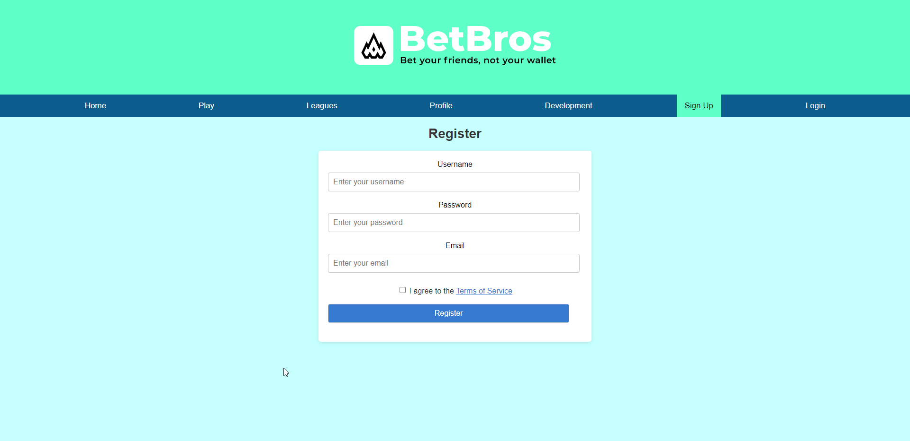
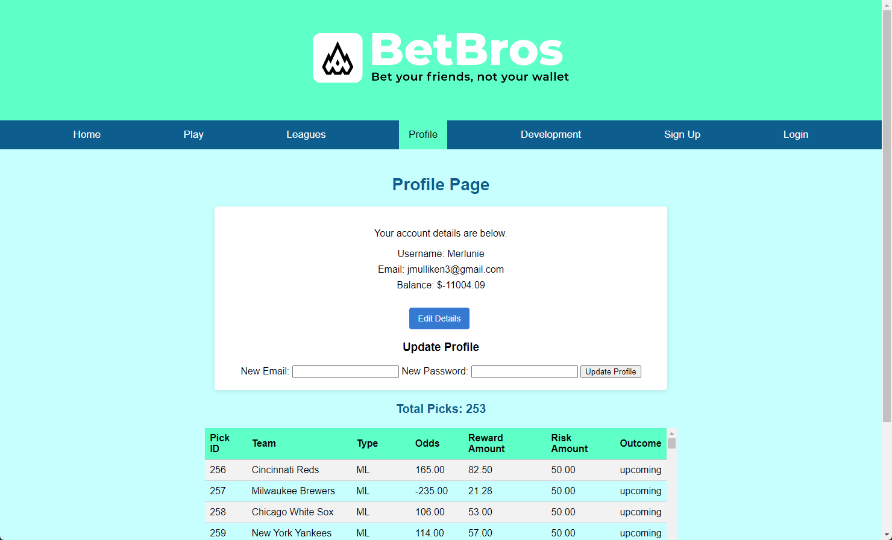
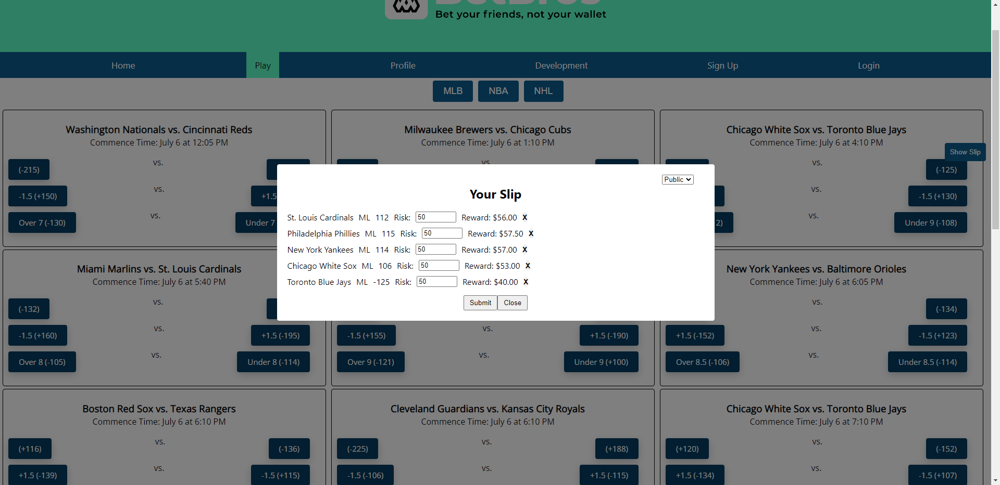
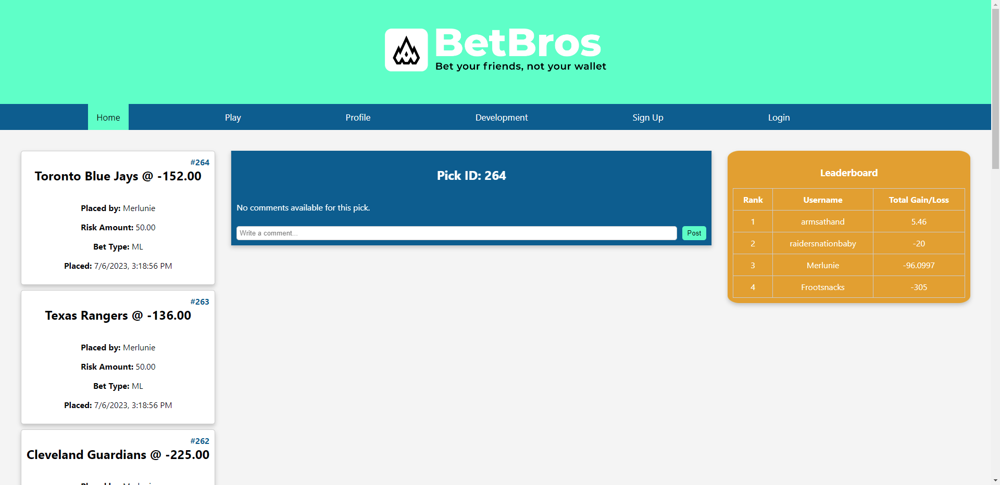
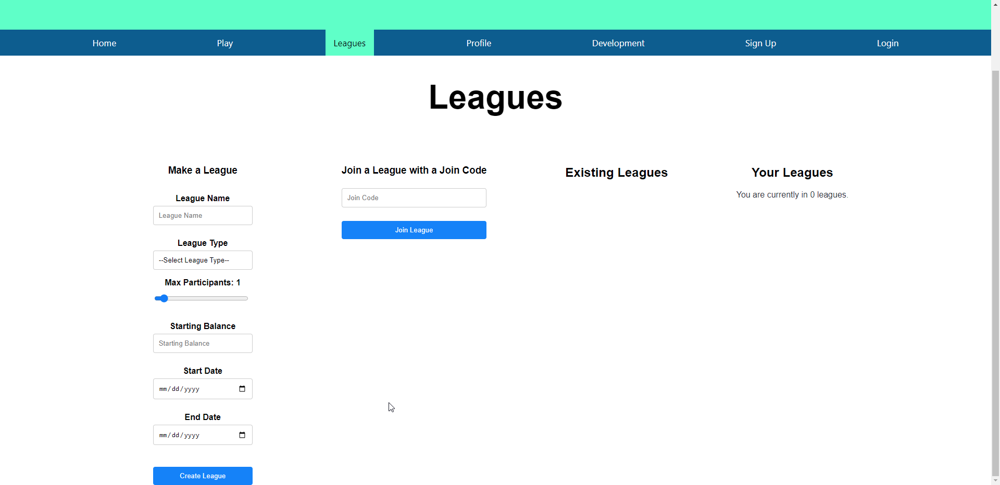

# Fantasy Gambling

Fantasy Gambling is a full-stack web application that combines the thrill of fantasy sports with the excitement of gambling. The backend is built with Node.js and Express.js, and the frontend is built with React.js.

## Backend Features

- **Environment Variables**: The application uses the dotenv package to load environment variables from a .env file. This is used to set the session secret for Express sessions.
- **Express Server**: The application uses Express.js to create a server. It uses various middleware for security (helmet), parsing request bodies (body-parser), handling cookies (cookie-parser), and enabling CORS.
- **Redis**: The application uses Redis for storing session data. It connects to a local Redis server and uses the connect-redis package to integrate Redis with Express sessions.
- **WebSocket**: The application uses the ws package to create a WebSocket server. It handles new connections, incoming messages, connection closures, and errors.
- **Routes**: The application has various routes for handling different types of requests. It uses separate route handlers for the root route, league-related routes, and admin-related routes.
- **Cron Jobs**: The application uses the node-cron package to schedule tasks. It has tasks for fetching and updating game results and odds, and updating league status.
- **MySQL**: The application uses MySQL for storing data. It uses the mysql2/promise package to interact with the MySQL database.
- **Axios**: The application uses the axios package to make HTTP requests to an external API for fetching game results.





## Frontend Applications

### PickerApp

The PickerApp is a React application that allows users to select games and place bets. It fetches game data from the backend server and displays it in a user-friendly format. Users can select a game, choose a bet type (Moneyline, Spread, or Total Over/Under), and enter the amount they want to risk. The potential reward is calculated and displayed automatically. The selected bets are added to a betting slip, which can be submitted to place the bets.




Here are the main components of the PickerApp:

- **App.js**: This is the main component of the application. It fetches game data from the server, manages the state of the betting slip, and renders the other components.
- **GameContainer.js**: This component represents a single game. It displays the teams, the commence time, and the available bets. Users can select a bet and add it to the betting slip from this component.
- **Slip.js**: This component represents the betting slip. It displays the selected bets, allows users to enter the amount they want to risk, and calculates the potential reward. Users can remove bets from the slip, and submit the slip to place the bets.
- **rewardCalculator.js**: This module contains a function to calculate the potential reward of a bet based on the amount risked and the price of the bet.

The PickerApp uses CSS for styling, and it includes a CSS file for each component.

### HomeFeedApp

The HomeFeedApp is a React application that displays a feed of upcoming picks, a comment section for the selected pick, and a leaderboard. The app fetches the picks from the backend server and updates the feed in real time.



Here are the main components of the HomeFeedApp:

- **App.js**: This is the main component of the application. It fetches the picks from the server, manages the state of the selected pick and the window size, and renders the other components.
- **PicksColumn.js**: This component displays a list of upcoming picks. Users can select a pick to view its comments.
- **CommentColumn.js**: This component displays the comments for the selected pick. If no pick is selected, it displays a placeholder message.
- **LeaderboardColumn.js**: This component displays the leaderboard, which ranks users based on their betting performance.

The HomeFeedApp uses CSS for styling, and it includes a CSS file for each component.

### LeagueCreationApp

The LeagueCreationApp is a React application that allows users to create and join leagues. It provides a form for users to input league details such as name, type, maximum participants, starting balance, and start and end dates. Users can also join existing leagues by entering a join code. The app communicates with the backend server to create and join leagues.



Here are the main components of the LeagueCreationApp:

- **App.js**: This is the main component of the application. It fetches the picks from the server, manages the state of the selected pick and the window size, and renders the other components.
- **LeagueCard.js**: This component represents a single league. It displays the league name, the number of participants, and the starting balance.
- **JoinLeagueForm.js**: This component provides a form for users to join an existing league. Users can enter a join code, and the form will send a request to the server to join the league.
- **LeagueCreationForm.js**: This component provides a form for users to create a new league. Users can enter the league details, and the form will send a request to the server to create the league.

The LeagueCreationApp uses CSS for styling, and it includes a CSS file for each component.

## Installation

To install and run this application, follow these steps:

1. Clone the repository to your local machine.
2. Navigate to each of the following folders and run the corresponding commands:

   - Backend:
     ```
     cd Backend
     npm install
     ```

   - Homepage:
     ```
     cd Homepage
     npm install
     npm run build
     ```

   - LeagueCreation:
     ```
     cd LeagueCreation
     npm install
     npm run build
     ```

   - Pickerapp:
     ```
     cd Pickerapp
     npm install
     npm run build
     ```

3. Once all dependencies are installed and the frontend applications are built, you can start the application.

